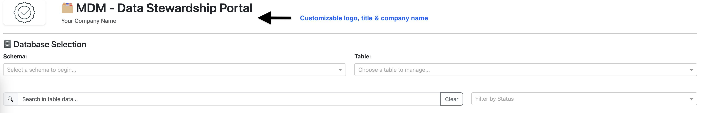
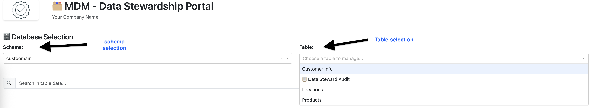
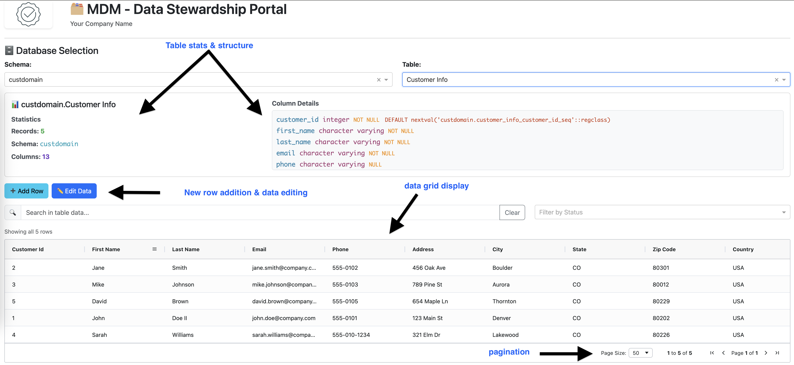
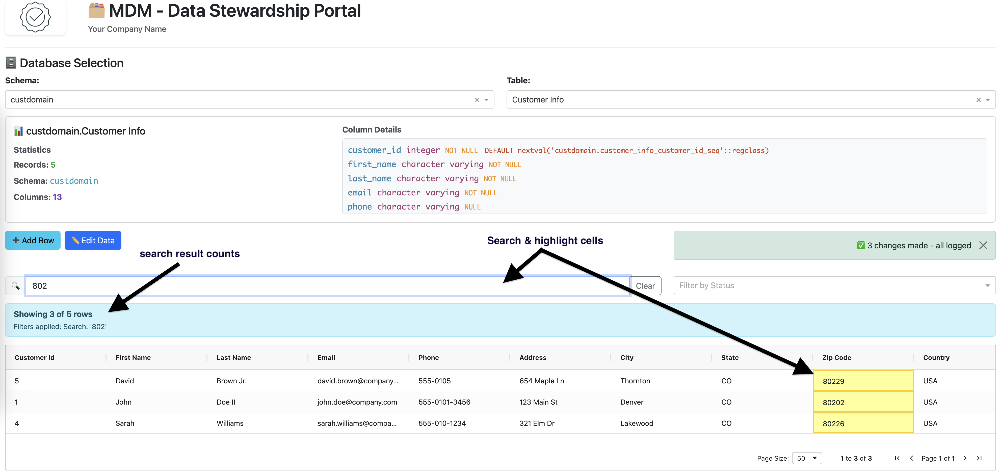
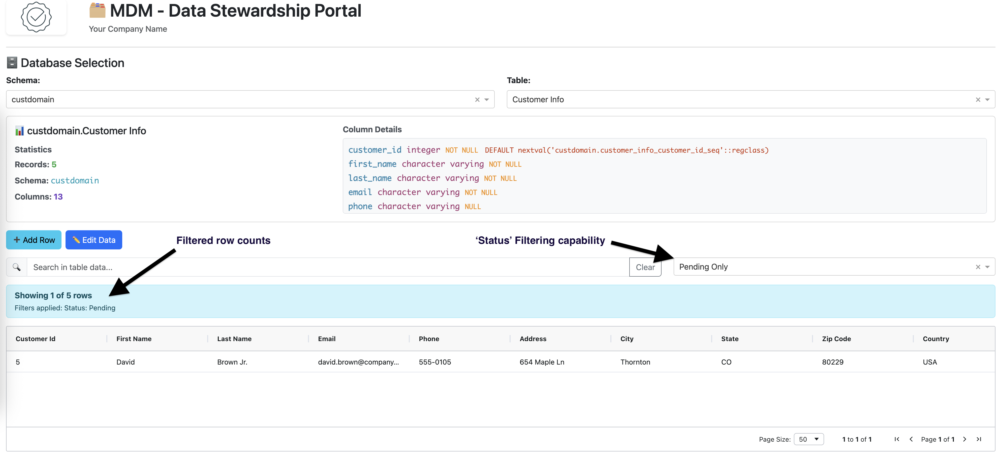
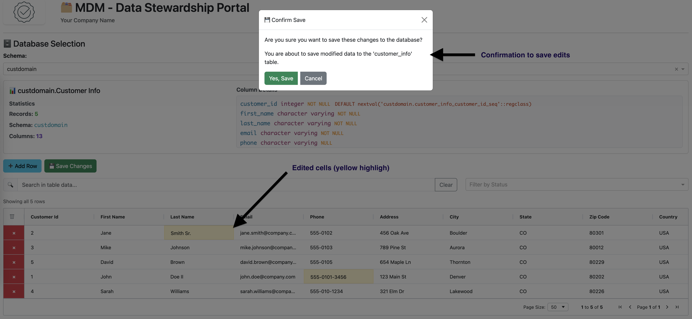
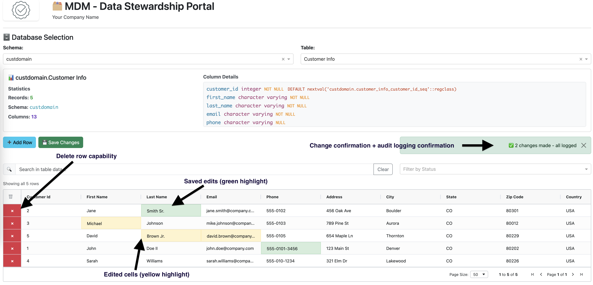
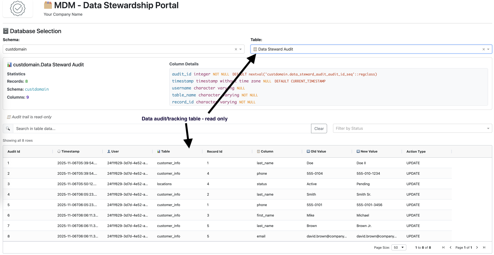

# 🗂️ Lakebase Data Stewardship Portal

A configurable, reusable data editor portal that can be deployed to any Lakebase instance for comprehensive data stewardship operations.

## ✨ Features

- **🔄 Dynamic Schema & Table Discovery**: Automatically discovers and lists all schemas and tables you have access to
- **📊 Complete CRUD Operations**: Create, Read, Update, Delete with comprehensive audit trail
- **🔍 Advanced Search & Filtering**: Global search with cell highlighting and dynamic status filtering
- **➕ Smart Row Management**: Add new rows with auto-generated IDs and delete functionality
- **📋 Comprehensive Audit Trail**: Track all changes with INSERT/UPDATE/DELETE logging
- **🎨 Configurable Branding**: Customize logo, title, and company name
- **🔐 OAuth Integration**: Secure authentication using Databricks OAuth tokens

## 📸 Screenshots

### 🏠 Home Screen & Navigation
<details>
<summary>Click to view Home Screen</summary>

[](assets/1-HomeScreen.png)
*Clean, branded interface with configurable logo and company name*

</details>

### 🔄 Dynamic Schema & Table Discovery
<details>
<summary>Click to view Schema & Table Selection</summary>

[](assets/2-Schema-TableSelection.png)
*Automatically discovers and lists all schemas and tables you have access to*

</details>

### 📊 Data Grid & CRUD Operations
<details>
<summary>Click to view Main Data Grid</summary>

[](assets/3-DataGrid.png)
*Complete data management interface with Add Row, Edit Data, and Save Changes functionality*

</details>

### 🔍 Advanced Search
<details>
<summary>Click to view Search Functionality</summary>

[](assets/6-Search.png)
*Global search with cell highlighting across all columns*

</details>

### 🎯 Dynamic Filtering
<details>
<summary>Click to view Status Filtering</summary>

[](assets/7-Filters.png)
*Filter data by status values with result count display*

</details>

### ✏️ Smart Edit Workflow
<details>
<summary>Click to view Edit Confirmation</summary>

[](assets/4-EditsConfirm.png)
*Confirmation dialogs for data changes with change summary*

</details>

### 🎨 Visual Change Tracking
<details>
<summary>Click to view Edit Colors & Audit</summary>

[](assets/5-EditsColors-audit.png)
*Color-coded changes with real-time audit trail integration*

</details>

### 📋 Comprehensive Audit Trail
<details>
<summary>Click to view Audit Tracking</summary>

[](assets/8-AuditTracking.png)
*Complete audit log with user attribution, timestamps, and before/after values*

</details>

## 🚀 Quick Start

### Prerequisites

- Databricks workspace
- Permissions to create Lakebase instances
- Access to create schemas and tables
- Permissions to deploy Databricks Apps
- **Databricks CLI properly authenticated** (see [Authentication Guide](https://docs.databricks.com/en/dev-tools/cli/authentication.html))

### Step 0: Get the Source Code

Clone this repository to get the Lakebase Data Stewardship Portal source code:

```bash
git clone https://github.com/prasanna-sk/lakebase-data-steward-app.git
cd lakebase-data-steward-app
```

### Step 1: Create Lakebase Database Instance

**First, create a Lakebase database instance in your Databricks workspace:**

1. **In Databricks workspace**:
   - Go to **Data** > **Create** > **Lakebase Database**
   - Choose a name for your instance (e.g., `sales-data-lake`, `customer-mdm`)
   - Configure settings as needed
   - **Note down the instance name and instance ID under configuration tab and host ID under connection details** after creation
   - The above noted values need to be replaced in `app.yaml` file in apps source directory.

2. **Gather connection details**:
   ```bash
   # After creation, you'll have:
   # - Lakebase Instance Name: my-sales-data-lake
   # - Lakebase Instance ID: lb-a1b2c3d4e5f67890
   # - Lakebase Host: instance-**********.database.azuredatabricks.net (if using Azure)
   ```

### Step 2: Set Up Your Database Resources

Create your database resources using the step-by-step approach due to limited PostgreSQL support in Databricks SQL Editor:

> **⚠️ IMPORTANT**: PostgreSQL support in Databricks SQL Editor is LIMITED. Follow these specific steps:

#### 1. **Create Schema**:
- After creating your Lakebase instance, click **"New Query"** (top right)
- This opens a query editor with Lakebase compute automatically attached
- Copy paste this command and execute it (replace `your_schema_name` with your actual schema name, e.g., `sales_data`):

```sql
CREATE SCHEMA IF NOT EXISTS your_schema_name;
```

#### 2. **Change Schema Context**:
- After schema creation succeeds, manually change the schema dropdown (above the query editor) to: `databricks_postgres.your_schema_name`
- This sets the context for all subsequent operations

#### 3. **Create Tables** (copy and paste the entire block below):

```sql
-- Customer Information Table
CREATE TABLE IF NOT EXISTS customer_info (
    customer_id SERIAL PRIMARY KEY,
    first_name VARCHAR(100) NOT NULL,
    last_name VARCHAR(100) NOT NULL,
    email VARCHAR(255) UNIQUE NOT NULL,
    phone VARCHAR(20),
    address VARCHAR(500),
    city VARCHAR(100),
    state VARCHAR(50),
    zip_code VARCHAR(20),
    country VARCHAR(100) DEFAULT 'USA',
    status VARCHAR(20) DEFAULT 'Active',
    created_date TIMESTAMP DEFAULT CURRENT_TIMESTAMP,
    last_updated TIMESTAMP DEFAULT CURRENT_TIMESTAMP
);

-- Location/Facility Information Table
CREATE TABLE IF NOT EXISTS locations (
    location_id SERIAL PRIMARY KEY,
    location_name VARCHAR(200) NOT NULL,
    address VARCHAR(500) NOT NULL,
    city VARCHAR(100) NOT NULL,
    state VARCHAR(50) NOT NULL,
    zip_code VARCHAR(20),
    country VARCHAR(100) DEFAULT 'USA',
    location_type VARCHAR(50), -- e.g., 'Warehouse', 'Office', 'Factory'
    region VARCHAR(100),
    status VARCHAR(20) DEFAULT 'Active',
    manager_name VARCHAR(200),
    phone VARCHAR(20),
    email VARCHAR(255),
    capacity INTEGER,
    created_date TIMESTAMP DEFAULT CURRENT_TIMESTAMP,
    last_updated TIMESTAMP DEFAULT CURRENT_TIMESTAMP
);

-- Product Information Table
CREATE TABLE IF NOT EXISTS products (
    product_id SERIAL PRIMARY KEY,
    product_name VARCHAR(200) NOT NULL,
    sku VARCHAR(100) UNIQUE NOT NULL,
    category VARCHAR(100),
    description TEXT,
    unit_price DECIMAL(10,2),
    stock_quantity INTEGER DEFAULT 0,
    supplier_id VARCHAR(100),
    status VARCHAR(20) DEFAULT 'Active',
    created_date TIMESTAMP DEFAULT CURRENT_TIMESTAMP,
    last_updated TIMESTAMP DEFAULT CURRENT_TIMESTAMP
);

-- Audit Trail Table (tracks all data changes)
CREATE TABLE IF NOT EXISTS data_steward_audit (
    audit_id SERIAL PRIMARY KEY,
    timestamp TIMESTAMP DEFAULT CURRENT_TIMESTAMP,
    username VARCHAR(255),
    table_name VARCHAR(255) NOT NULL,
    record_id VARCHAR(255) NOT NULL,
    column_name VARCHAR(255) NOT NULL,
    old_value TEXT,
    new_value TEXT,
    action_type VARCHAR(20) DEFAULT 'UPDATE'
);
```

#### 4. **Insert Sample Data** (Optional - copy and paste the entire block below):

```sql
-- Sample Customer Data
INSERT INTO customer_info
(first_name, last_name, email, phone, address, city, state, zip_code, country, status)
VALUES
('John', 'Doe', 'john.doe@company.com', '555-0101', '123 Main St', 'Denver', 'CO', '80202', 'USA', 'Active'),
('Jane', 'Smith', 'jane.smith@company.com', '555-0102', '456 Oak Ave', 'Boulder', 'CO', '80301', 'USA', 'Active'),
('Mike', 'Johnson', 'mike.johnson@company.com', '555-0103', '789 Pine St', 'Aurora', 'CO', '80012', 'USA', 'Inactive'),
('Sarah', 'Williams', 'sarah.williams@company.com', '555-0104', '321 Elm Dr', 'Lakewood', 'CO', '80226', 'USA', 'Active'),
('David', 'Brown', 'david.brown@company.com', '555-0105', '654 Maple Ln', 'Thornton', 'CO', '80229', 'USA', 'Pending');

-- Sample Location Data
INSERT INTO locations
(location_name, address, city, state, zip_code, country, location_type, region, status, manager_name, phone, email, capacity)
VALUES
('Denver Manufacturing', '123 Industrial Blvd', 'Denver', 'CO', '80202', 'USA', 'Factory', 'Mountain West', 'Active', 'Mark Anderson', '303-555-0201', 'mark.anderson@company.com', 50000),
('Boulder Distribution Center', '456 Logistics Ave', 'Boulder', 'CO', '80301', 'USA', 'Warehouse', 'Mountain West', 'Active', 'Susan Chen', '303-555-0202', 'susan.chen@company.com', 75000),
('Corporate Headquarters', '789 Executive Dr', 'Broomfield', 'CO', '80020', 'USA', 'Office', 'Mountain West', 'Active', 'James Wilson', '303-555-0203', 'james.wilson@company.com', 1000),
('Aurora Facility', '321 Production Way', 'Aurora', 'CO', '80012', 'USA', 'Factory', 'Mountain West', 'Active', 'Maria Rodriguez', '303-555-0204', 'maria.rodriguez@company.com', 40000);

-- Sample Product Data
INSERT INTO products
(product_name, sku, category, description, unit_price, stock_quantity, supplier_id, status)
VALUES
('Widget A', 'WID-001', 'Components', 'Standard widget component', 25.99, 1000, 'SUP-001', 'Active'),
('Widget B', 'WID-002', 'Components', 'Premium widget component', 45.99, 500, 'SUP-001', 'Active'),
('Gadget X', 'GAD-001', 'Electronics', 'Multi-purpose electronic gadget', 199.99, 250, 'SUP-002', 'Active'),
('Tool Set Alpha', 'TOL-001', 'Tools', 'Professional tool set', 149.99, 150, 'SUP-003', 'Active'),
('Accessory Kit', 'ACC-001', 'Accessories', 'Standard accessory kit', 29.99, 800, 'SUP-001', 'Active');
```

### Step 3: Initial App Configuration

Update `app.yaml` with your Lakebase instance details: (located in the directory that was cloned from the github repo)

> **⚠️ PREREQUISITE**: Ensure Databricks CLI is properly authenticated before deployment. If not configured, follow the [Databricks CLI Authentication Guide](https://docs.databricks.com/en/dev-tools/cli/authentication.html) to set up your authentication. 
>
> If not using CLI, use Databricks Workspace tab and edit the files directly in UI (no need for CLI for this).

**Update `app.yaml`** with your Lakebase instance details:
```yaml
env:
  # Lakebase Instance Configuration (from Step 0)
  - name: 'LAKEBASE_INSTANCE_NAME'
    value: 'your_lakebase_instance_name'  # Your actual instance name
  - name: 'LAKEBASE_INSTANCE_ID'
    value: 'your_lakebase_instance_id'    # Your actual instance ID

  # PostgreSQL Connection Settings
  - name: 'PGDATABASE'
    value: 'databricks_postgres'  # Database name when Lakebase is added as app resource
  - name: 'PGUSER'
    value: 'placeholder-service-principal'  # Temporary - will update in Step 5
  - name: 'PGHOST'
    value: 'your-lakebase-hostname.databricks.com'  # Your Lakebase hostname
  - name: 'PGPORT'
    value: '5432'
  - name: 'PGSSLMODE'
    value: 'require'
  - name: 'PGAPPNAME'
    value: 'your-app-name'  # use the same name you will use for your Databricks app name

  # Database Configuration
  - name: 'DEFAULT_SCHEMA'
    value: 'your_schema_name'  # Schema name from Step 2

  # Application Settings (customize as needed)
  - name: 'APP_TITLE'
    value: 'MDM - Data Stewardship Portal'
  - name: 'COMPANY_NAME'
    value: 'Your Company Name'
```

### Step 4: Initial Deployment (to get Service Principal)

Deploy the app to get the service principal ID:

**Option A: CLI Deployment**
```bash
databricks apps deploy your-app-name --source-code-path .
```
> **Note**: Replace `your-app-name` with the same name you used for `PGAPPNAME` in your app.yaml

**Option B: UI Deployment**
1. Go to **Compute --> Apps** in your databricks workspace
2. Click **Create App**
3. Select **Create a custom app**
4. Enter the same name that you used for `PGAPPNAME` in `app.yaml`
5. Click **Next: Configure** (Do not just create the app. If you did, you can edit it later)
6. Under **App resources** --> `Add Resource` --> choose `Database`
7. Select the Lakebase instance you just created (you can type/search) and select `databricks_postgres` under Select database option. Leave other values as-is.
8. Create App. 

> **Expected Result**: App deploys successfully but won't work properly yet (Unavailable state). This is normal and expected.

> **⚠️ Note**: App creation can take a few minutes. Please wait patiently.

**Get the Service Principal ID**:

Once the app is created and ready, navigate to `Authorization` tab and copy the `Service Principal` by clicking the copy button.

> **📋`DATABRICKS_CLIENT_ID` and `DATABRICKS_CLIENT_SECRET` are used for OAuth authentication by Databricks Apps. The Client ID is the `Service Principal`, Client Secret will be programatically fetched and refreshed as needed.** 

```bash
# CLI Option
databricks apps get your-app-name
# Note down the service principal ID from the output - you'll need this for Step 5
```

### Step 5: Update App with Real Service Principal and Redeploy

**Update `app.yaml`** with the real service principal ID from Step 4:
```yaml
  # PostgreSQL Connection Settings
  - name: 'PGUSER'
    value: '*****-******-****-****-*********'  # Your actual service principal ID
```

**Redeploy the Application**:

**Option A: CLI Redeploy**
```bash
databricks apps deploy your-app-name --source-code-path .
```

**Option B: UI Redeploy**
1. Go to your existing app in **Databricks Apps**
2. Upload the updated `app.yaml` file
3. Click **Deploy** to redeploy with the new service principal ID 

> **⚠️ Note**: select the directory path where source code resides (this dir should have the updated `app.yaml` file)

### Step 6: Grant Permissions

Now grant permissions to the service principal from Step 4:

1. **Replace placeholders with actual values**:
   - `your_schema_name` → your actual schema name (same as Step 2)
   - `your-service-principal-id` → actual service principal ID from Step 4

2. **Execute the GRANT Statements** (copy and paste the entire block below):

```sql
-- Schema permissions (required for basic access)
GRANT USAGE ON SCHEMA your_schema_name TO "your-service-principal-id";

-- Table permissions (required for CRUD operations)
GRANT SELECT, INSERT, UPDATE, DELETE ON ALL TABLES IN SCHEMA your_schema_name TO "your-service-principal-id";

-- Sequence permissions (required for auto-increment fields and audit trail)
GRANT USAGE, SELECT ON ALL SEQUENCES IN SCHEMA your_schema_name TO "your-service-principal-id";
```

3. **✅ Your app is now fully functional!**

> **Note**: The app will deploy successfully in Step 4 even without permissions. It will show permission errors in logs until Step 6 is completed, which is normal and expected.

## 🗄️ Database Setup

### Schema Requirements

The app requires at least one schema with tables that have:
- A primary key column (preferably SERIAL for auto-incrementing)
- Standard PostgreSQL data types (VARCHAR, INTEGER, DECIMAL, TIMESTAMP, etc.)

### Audit Table

The app can **automatically create** a `data_steward_audit` table when the first change is made, or you can create it manually using the SQL provided in Step 2 above.

## 🎯 Usage Guide

### 1. Schema Selection
- Choose your schema from the dropdown
- Tables will automatically populate based on your selection

### 2. Table Management
- **View Data**: Select a table to view and explore data
- **Add Rows**: Click "➕ Add Row" to create new records
- **Edit Data**: Click "✏️ Edit Data" to modify existing records
- **Delete Rows**: In edit mode, click "×" to remove rows
- **Save Changes**: Click "💾 Save Changes" to persist modifications

### 3. Search & Filter
- **Global Search**: Use the search box to find data across all columns
- **Status Filter**: Filter by specific status values
- **Result Count**: View "X of Y rows" when filtering is applied

### 4. Audit Trail
- Select the audit table to view all changes
- Track INSERT, UPDATE, and DELETE operations
- See who made changes and when

## 🔧 Customization

### Adding Your Own Tables

1. Create tables in your schema following the pattern:
   ```sql
   CREATE TABLE your_schema.your_table (
       id BIGINT AUTO_INCREMENT PRIMARY KEY,
       -- your columns here
       status STRING DEFAULT 'Active',
       created_date TIMESTAMP DEFAULT CURRENT_TIMESTAMP(),
       last_updated TIMESTAMP DEFAULT CURRENT_TIMESTAMP()
   ) USING DELTA;
   ```

2. Grant permissions:
   ```sql
   GRANT SELECT, INSERT, UPDATE, DELETE ON TABLE your_schema.your_table TO 'your-service-principal-id';
   ```

3. The app will automatically discover your new tables!

### Custom Branding

1. **Logo**: Set `LOGO_URL` to your company logo
2. **Title**: Customize `APP_TITLE` for your organization
3. **Company**: Set `COMPANY_NAME` for proper attribution

## 🛡️ Security & Permissions

### Required Permissions

Your service principal needs:
- `USAGE` on the schema
- `SELECT, INSERT, UPDATE, DELETE` on all tables
- Ability to create the audit table (if it doesn't exist)

### OAuth Authentication

The app uses Databricks OAuth tokens which:
- Automatically refresh every 15 minutes
- Provide secure, temporary access
- Inherit the user's permissions

## 📊 Monitoring & Audit

### Audit Trail Features
- **Complete Change Tracking**: Every INSERT, UPDATE, DELETE is logged
- **User Attribution**: Track who made each change
- **Timestamp Precision**: Exact time of each modification
- **Before/After Values**: See old and new values for updates

### Audit Table Queries

```sql
-- View recent changes
SELECT * FROM your_schema.data_steward_audit
ORDER BY timestamp DESC
LIMIT 100;

-- Changes by user
SELECT username, COUNT(*) as change_count
FROM your_schema.data_steward_audit
GROUP BY username;

-- Changes by table
SELECT table_name, action_type, COUNT(*) as change_count
FROM your_schema.data_steward_audit
GROUP BY table_name, action_type;
```

## 🔍 Troubleshooting

### Common Issues

1. **"Deployment fails - authentication error"**
   - Ensure Databricks CLI is properly authenticated
   - Run `databricks auth login` or see [Authentication Guide](https://docs.databricks.com/en/dev-tools/cli/authentication.html)
   - Verify you have permissions to deploy Databricks Apps

2. **"Name or service not known" / Connection timeout**
   - **Wrong PGHOST**: You're using workspace URL instead of Lakebase instance hostname
   - Find correct hostname from your **Lakebase instance connection details**
   - Use format like `lakebase-abc123.databricks.com` (NOT `my-workspace.databricks.com`)
   - Check connection details in SQL Editor when connected to your Lakebase instance

3. **"Schema not found"**
   - Verify your `DEFAULT_SCHEMA` environment variable
   - Check that your service principal has access to the schema

4. **"Permission denied"**
   - Ensure proper GRANT statements have been executed
   - Verify service principal ID is correct

5. **"Table not appearing"**
   - Check that tables exist and are type 'BASE TABLE'
   - Verify permissions on the specific table

6. **"OAuth token refresh failed"**
   - Check that the service principal is properly configured
   - Verify workspace client configuration

### Debug Mode

Set environment variable for debugging:
```yaml
- name: 'DEBUG'
  value: 'true'
```

## 📁 File Structure

```
lakebase-data-steward-app/
├── app.py                      # Main application
├── app.yaml                    # Configuration & environment variables
├── requirements.txt            # Python dependencies
├── README.md                   # This documentation (includes all SQL statements)
├── SETUP_CHECKLIST.md          # Step-by-step setup checklist
└── assets/                     # Static assets (optional)
```

## 🤝 Support

For issues or questions:
1. Check the troubleshooting section above
2. Verify your configuration against this documentation
3. Review the audit logs for any error messages
4. Check Databricks Apps logs for detailed error information

## 📄 License

This is a reusable template for data stewardship applications. Customize as needed for your organization.

---

**🎉 Your Lakebase Data Stewardship Portal is ready to use!**

The app will automatically discover your schemas and tables, providing a powerful interface for managing your master data with complete audit capabilities.